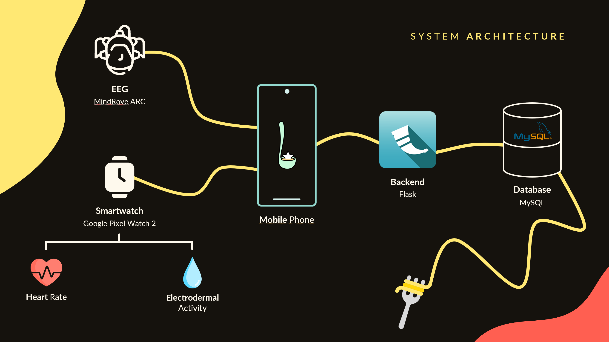
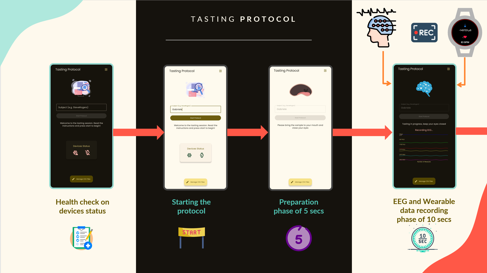
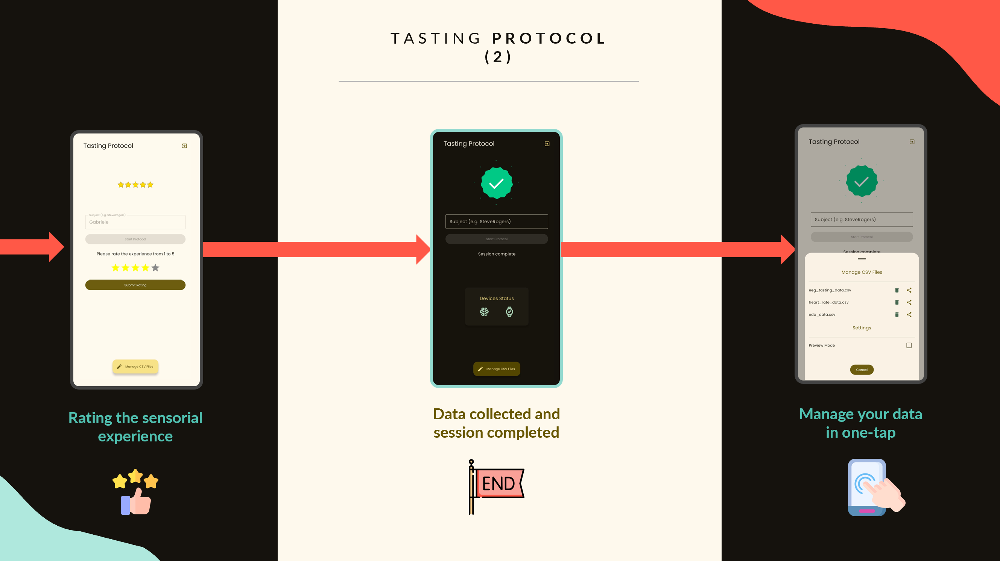

</br>

# Table of Contents
- [Table of Contents](#table-of-contents)
- [Overview](#overview)
- [System Features](#system-features)
- [Scientific Background](#scientific-background)
- [System Architecture](#system-architecture)
- [Installation](#installation)
  - [Installation via APK](#installation-via-apk)
  - [Building from Source (Android Studio)](#building-from-source-android-studio)
- [Usage](#usage)
  - [🧠 Training Mode](#-training-mode)
  - [⚡ Inference Mode](#-inference-mode)
- [Result \& Evaluation](#result--evaluation)
- [License](#license)
- [Contributors](#contributors)

# Overview
Foodback is a mobile app that automatically rates food by analyzing physiological and neural signals from wearable devices like EEG headsets and smartwatches. During short tasting sessions, the system captures brain activity, heart rate, and skin responses, using a deep learning model to predict food enjoyment on a 5-point scale. It offers a scalable, objective, and effortless alternative to traditional food reviews.

# System Features
The presented application is a **prototype** developed to demonstrate the feasibility of fully automated, user-independent food rating through physiological and neural signal analysis. While functional, the system remains at an experimental stage, aimed primarily at validating core concepts and guiding future development. The prototype's implemented functionalities include:

* 🤖 Automatic Food Rating
* 📡 Real-Time Multimodal Signal Integration
* 🧠 Lightweight End-to-End Neural Architecture
* 🔄 Dual Operational Modes
* 🔐 Secure Authentication and Role-Based Access
* 🎯 Guided Experiment Interface
* ⌚ Reliable Wearable Synchronization
* 🧩 Modular and Extensible Architecture

# Scientific Background
Our system builds on recent research in emotion and sensory recognition using wearable and neural signals. Notably, [EmotionSense](https://dl.acm.org/doi/abs/10.1145/3384394?casa_token=1_weDYcQRMUAAAAA:SGxIzGSlrhrdo7eTaPnmUtZ5AC9DSPp-LuJRtoXeSyELLNCTwNPEX5NsoJhj3y6VSAoDDx9x_zxotw) demonstrated emotion tracking via smartwatches with context-aware modeling, but was limited to general emotional states and lacked integration with neural data, reducing its applicability to specific experiences like food enjoyment.

Conversely, [Zhang et al.](https://link.springer.com/article/10.1007/s10489-024-05374-5) achieved high-accuracy taste recognition using EEG and deep learning, but relied on artificial lab settings, with limited ecological validity and potential methodological biases due to unclear data partitioning.

Our approach integrates smartwatch and EEG data in real-world settings, capturing both physiological and cognitive responses to food. This enables automated, objective, and scalable reviews of food experiences, bridging the gap between lab-grade precision and everyday usability.

# System Architecture
</br>

The system is composed of multiple interconnected components designed to capture, process, and store physiological and neural signals during food consumption in real-world settings.

* **EEG (MindRove ARC)**: Captures brain activity related to sensory and cognitive responses during eating.
* **Smartwatch (Google Pixel Watch 2)**: Records **heart rate** and **electrodermal activity**, providing real-time indicators of emotional arousal.
* **Mobile Phone**: Acts as the central hub, collecting data from the EEG and smartwatch, running the neural inference model, and providing a user-facing interface.
* **Backend (Flask)**: Manages communication between the mobile app and the database, handling data processing, API endpoints, and user/session management.
* **Database (MySQL)**: Stores collected signals, model outputs, and metadata securely, enabling long-term logging and future analysis.

# Installation
For the application to function correctly, all three main components must be installed:

* **Mobile App (Android)**
* **Wearable Companion App (Wear OS)**
* **Flask Backend Server (Python)**

The first two components (mobile and wearable apps) can be installed using either of the following methods:

* **Via pre-built APKs**
* **By building from source using Android Studio**

The Flask server must be set up separately by running the Python backend locally or on a remote host. Detailed instructions for each installation method are provided below.

## Installation via APK

1. **Download the latest APKs** from the [Releases](TODO) section.
2. **Enable installation from unknown sources** on your Android phone and/or Wear OS watch.
3. **Install the APKs manually**:

   * For the mobile app: transfer and open `TODO.apk` on your Android phone.
   * For the wearable app: use `adb` to install `TODO.apk` on your watch:

     ```bash
     adb connect <WATCH_IP_ADDRESS>
     adb -s <WATCH_IP_ADDRESS> install TODO.apk
     ```

     > You can find the watch’s IP address under **Developer Options** > **Network** on your Wear OS device.

## Building from Source (Android Studio)
We recommend using Android Studio to modify, run, or compile the source code of both the mobile and wearable applications.

1. **Clone the repository**:

   ```bash
   git clone https://github.com/Dimerin/Foodback
   cd Foodback
   ```
2. **Open the project in Android Studio**.
3. Choose the module to build:

   * `:app` for the Android app
   * `:wear` for the Wear OS companion app
4. Connect your devices via USB or Wi-Fi.
5. Press ▶️ **Run**, or generate APKs via **Build > Build Bundle(s) / APK(s)**.

# Usage
The application can be used in two main modes, depending on the context:

* **🧠 Training Mode**
  For structured data collection using a guided tasting protocol. This mode is used to build or update the machine learning model.

* **⚡ Inference Mode**
  For real-time evaluation of food experiences using a pre-trained model. This mode is intended for end users.

## 🧠 Training Mode
In **Training Mode**, the application guides the user through a structured protocol to collect synchronized physiological and neural signals during food tasting. The protocol consists of the following steps:
* **Device Initialization**:
  The protocol begins once the **EEG headset** and the **wearable watch** (recording **heart rate** and **electrodermal activity**) are properly connected and actively transmitting data.

* **Preparation Phase (5 seconds)**:
  A **first beep** signals the subject to bring the food sample into their mouth.
  This 5-second window allows the subject to prepare for tasting.

* **Recording Phase (10 seconds)**:
  A **second beep** marks the beginning of the data recording session.
  For the next **10 seconds**, the system captures:

  * EEG signals (brain activity)
  * Heart rate (HR)
  * Electrodermal activity (EDA)
    These signals represent the subject’s physiological and emotional response to the food.

* **Rating Phase**:
  A **final beep** indicates the end of the recording.
  A **rating interface** appears, allowing the **administrator** to enter a subjective evaluation of the subject’s experience, typically using a predefined scale (e.g., liking, intensity, valence).

All phases are guided through the user interface, with visual cues and audio signals to assist both the subject and the administrator.


</br>
</br>

## ⚡ Inference Mode
In this mode, the data collected from the sensors is immediately processed for inference, generating a score from the pre-trained model. All computations are performed directly on the phone.

</br>

# Result & Evaluation
The study involved 10 volunteers (aged 16–56) with 45 tasting sessions, generating labeled EEG and smartwatch data paired with self-reported ratings. This multimodal dataset was used to train and validate the model over 1000 epochs with 10% validation split.

Two evaluation strategies were tested:

* A **session-level split** (80/20), keeping entire sessions exclusive to train or test sets, achieved about **33.33%** accuracy.
* An **epoch-level split** randomly divided 2-second epochs regardless of sessions, yielding higher accuracy (\~**73.33%**).

The likely motivation behind this discrepancy is information leakage in the epoch-level split, caused by overlap of session-specific signals between training and test sets, which artificially inflates performance. Therefore, only the session-level split provides a reliable estimate of the model’s true generalization ability.

# License
TODO

# Contributors
This project was developed as part of a university course assignment at University of Pisa. Here are the members of the team:

<div class="contributors-container">
  <a href="https://github.com/Califfo8" target="_blank" class="contributor-card">
    
    <span class="contributor-name">Tommaso Califano</span>
  </a>

  <a href="https://github.com/giovanniligato" target="_blank" class="contributor-card">
    
    <span class="contributor-name">Giovanni Ligato</span>
  </a>

  <a href="https://github.com/nicorama06" target="_blank" class="contributor-card">
    
    <span class="contributor-name">Nicola Ramacciotti</span>
  </a>

  <a href="https://github.com/Dimerin" target="_blank" class="contributor-card">
    
    <span class="contributor-name">Gabriele Suma</span>
  </a>
</div>

<style>
  .contributors-title {
    text-align: center;
  }

  .contributors-text {
    text-align: center;
  }

  .contributors-container {
    display: flex;
    flex-wrap: wrap;
    gap: 20px;
    justify-content: center;
    
  }

  .contributor-card {
    display: flex;
    align-items: center;
    gap: 12px;
    padding: 10px 20px;
    background: #24292e;
    color: white;
    border-radius: 8px;
    text-decoration: none;
    font-weight: 600;
    box-shadow: 0 4px 8px rgba(0, 0, 0, 0.15);
    transition: background-color 0.3s ease;
    min-width: 180px;
  }

  .contributor-card:hover {
    background-color: #3c4147;
  }

  .avatar {
    width: 40px;
    height: 40px;
    border-radius: 50%;
  }

  .contributor-name {
    flex-grow: 1;
    text-align: center;
  }
</style>